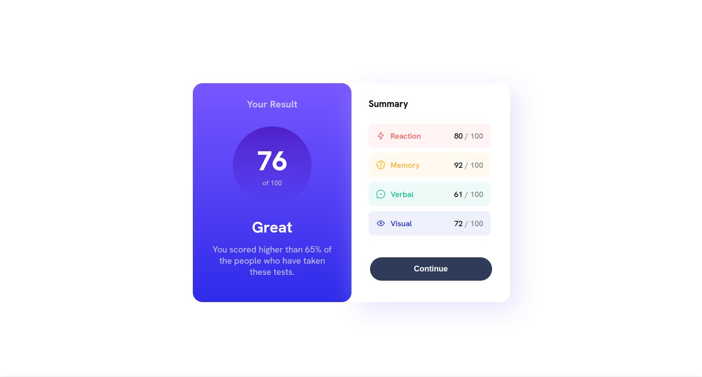
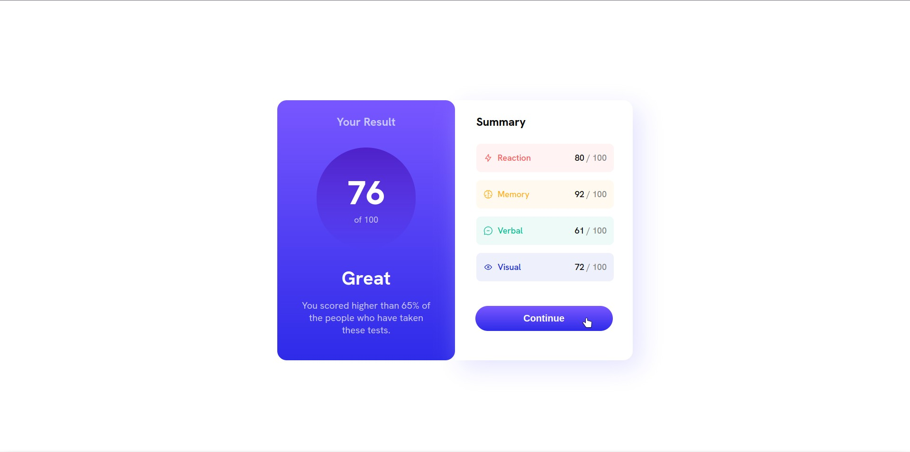
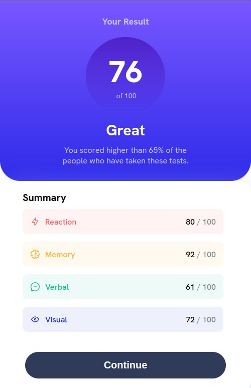

# Frontend Mentor - Results summary component solution

This is a solution to the [Results summary component challenge on Frontend Mentor](https://www.frontendmentor.io/challenges/results-summary-component-CE_K6s0maV). Frontend Mentor challenges help you improve your coding skills by building realistic projects. 

## Table of contents

- [Overview](#overview)
  - [The challenge](#the-challenge)
  - [Screenshot](#screenshot)
  - [Links](#links)
- [My process](#my-process)
  - [Built with](#built-with)
  - [What I learned](#what-i-learned)
  - [Continued development](#continued-development)
  - [Useful resources](#useful-resources)
- [Author](#author)

## Overview

### The challenge

Users should be able to:

- View the optimal layout for the interface depending on their device's screen size
- See hover and focus states for all interactive elements on the page
- **Bonus**: Use the local JSON data to dynamically populate the content

### Screenshot





### Links

- Solution URL: [Solution URL](https://www.frontendmentor.io/solutions/kind-of-responsive-results-summary-CxrUXssY4c)
- Live Site URL: [Live site URL](https://gabriel025.github.io/results-summary/)

## My process

### Built with

- Semantic HTML5 markup (Kind of)
- CSS custom properties
- Flexbox

### What I learned

Besides the practical experience, I learned how to make a gradient for a background. Example of one that I used below.

```css
.result-div {
    background: linear-gradient(hsl(252, 100%, 67%), hsl(241, 81%, 54%));
}
```

### Continued development

I think the main thing i need to improve is making the design more responsive to a wide variety of screen sizes. There were problably better ways to do what i did here.

### Useful resources

- [Mozilla](https://developer.mozilla.org/en-US/docs/Web/CSS/gradient/linear-gradient) - This helped me with the gradients used on the left side

**Note: Delete this note and replace the list above with resources that helped you during the challenge. These could come in handy for anyone viewing your solution or for yourself when you look back on this project in the future.**

## Author

- GitHub - [@Gabriel025](https://www.your-site.com)
- LinkedIn - [Gabriel Silva](https://www.linkedin.com/in/gabriel-silva-9b84aa2b6/y)
- Frontend Mentor - [@Gabriel025](https://www.frontendmentor.io/profile/Gabriel025)


